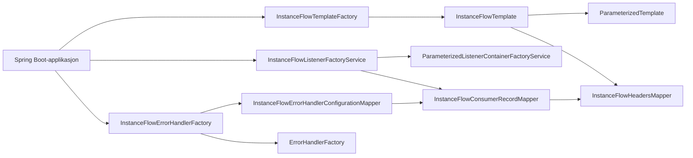

# FINT Flyt Kafka Bibliotek

[](https://github.com/FINTLabs/fint-flyt-kafka/actions/workflows/ci.yaml)

Et Spring Boot-bibliotek for Kafka-basert Flyt-integrasjon som bygger videre på `no.novari:kafka` og legger til:

- serialisering av `InstanceFlowHeaders` i Kafka-headeren `flyt.instance-flow-headers`
- type-safe wrappers for producing og consuming med instance flow headers
- error-handler-oppsett som arbeider med `InstanceFlowConsumerRecord`
- modellklasser for error-event payloads (`Error`, `ErrorCollection`)

README-en er skrevet for:

- team som allerede bruker `no.novari:kafka`
- applikasjoner som skal produsere eller konsumere Flyt-meldinger med instance flow headers
- team som skal migrere fra eldre `no.fintlabs`-baserte versjoner av biblioteket

Denne README-en dekker bare Flyt-tilleggene. For topic-navngivning, `ListenerConfiguration`, request/reply, topic-oppretting, retry/recovery-semantikk og generell Kafka-oppførsel, se dokumentasjonen i [fint-kafka](https://github.com/FINTLabs/fint-kafka/blob/main/README.md).

## Innhold

1. [Kom i gang](#kom-i-gang)
2. [Hvordan biblioteket er bygget opp](#hvordan-biblioteket-er-bygget-opp)
3. [Instance flow headers](#instance-flow-headers)
4. [Producere](#producere)
5. [Consumere](#consumere)
6. [Feilhåndtering](#feilhåndtering)
7. [Error-event payloads](#error-event-payloads)
8. [Avgrensninger](#avgrensninger)
9. [Best practices](#best-practices)
10. [Feilsøking](#feilsøking)
11. [API-hurtigreferanse](#api-hurtigreferanse)
12. [Oppgraderingsguider](docs/upgrading/README.md)

## Kom i gang

### Avhengighet

Biblioteket publiseres som `no.novari:flyt-kafka`.

Gradle:

```kotlin
dependencies {
    implementation("no.novari:flyt-kafka:<version>")
}
```

### Plattformkrav for gjeldende major (`v6`)

- Java `25`
- Gradle wrapper `9.3.1` dersom du bygger biblioteket selv
- underliggende Kafka-bibliotek: `no.novari:kafka:6.0.0`

### Spring-oppsett

Biblioteket eksponerer egne Spring-beans i pakken `no.novari.flyt.kafka`, men har ingen egen auto-konfigurasjonsklasse i denne repoen. Applikasjonen må derfor enten:

- component-scanne `no.novari.flyt.kafka`, eller
- registrere de aktuelle beanene selv

Eksempel:

```java
import org.springframework.boot.autoconfigure.SpringBootApplication;
import org.springframework.context.annotation.ComponentScan;

@SpringBootApplication
@ComponentScan(basePackages = {"com.example", "no.novari.flyt.kafka"})
public class Application {
}
```

### Minimal konfigurasjon

For Flyt-topics bør `novari.kafka.topic.domain-context` normalt settes til `flyt` i applikasjonens egen konfigurasjon:

```yaml
spring:
  kafka:
    bootstrap-servers: localhost:9092
    consumer:
      group-id: my-consumer-group

novari:
  kafka:
    application-id: my-app
    default-replicas: 1
    topic:
      org-id: my-org
      domain-context: flyt

fint:
  kafka:
    enable-ssl: false
```

Viktige nøkler:

- `novari.kafka.application-id` brukes av underliggende `no.novari:kafka`
- `novari.kafka.topic.org-id` og `novari.kafka.topic.domain-context` er defaults i topic-navn
- `novari.kafka.topic.domain-context` bør normalt være `flyt` for applikasjoner som bruker dette biblioteket

## Hvordan biblioteket er bygget opp

Biblioteket wrapper noen sentrale byggesteiner fra `no.novari:kafka`:



Det betyr i praksis:

- topic-navngivning, producer-config, consumer-config og request/reply-grunnlag kommer fra `no.novari:kafka`
- dette biblioteket legger på og leser av `InstanceFlowHeaders`
- listenere får `InstanceFlowConsumerRecord<V>` i stedet for bare `ConsumerRecord<String, V>`

For detaljert forklaring av de underliggende komponentene, se [fint-kafka](https://github.com/FINTLabs/fint-kafka/blob/main/README.md).

## Instance flow headers

Headeren ligger i Kafka under nøkkelen `flyt.instance-flow-headers`.

Klassen `InstanceFlowHeaders` inneholder blant annet:

- `sourceApplicationId`
- `sourceApplicationIntegrationId`
- `sourceApplicationInstanceId`
- `correlationId`
- `integrationId`
- `instanceId`
- `configurationId`
- `archiveInstanceId`
- `fileIds`

To felter er eksplisitt påkrevde i modellen:

- `sourceApplicationId`
- `correlationId`

Mapperen oppfører seg slik:

- producer-side: `InstanceFlowHeadersMapper.toHeaders(...)` serialiserer objektet til JSON i Kafka-header
- consumer-side: `InstanceFlowHeadersMapper.getInstanceFlowHeaders(...)` leser headeren tilbake til `InstanceFlowHeaders`
- manglende header gir `NoInstanceFlowHeadersException`
- ugyldig header-innhold gir `CouldNotReadInstanceFlowHeadersException`
- serialiseringsfeil ved produksjon gir `CouldNotWriteInstanceFlowHeadersException`

## Producere

### Hoved-API

- `InstanceFlowTemplateFactory`
- `InstanceFlowTemplate<VALUE>`
- `InstanceFlowProducerRecord<VALUE>`

Det finnes bare ett producer-API i dagens major-versjoner. Hvilken topic-type du sender til avgjøres av `TopicNameParameters`-typen du legger i `InstanceFlowProducerRecord`.

### Event-eksempel

```java
import no.novari.flyt.kafka.instanceflow.headers.InstanceFlowHeaders;
import no.novari.flyt.kafka.instanceflow.producing.InstanceFlowProducerRecord;
import no.novari.flyt.kafka.instanceflow.producing.InstanceFlowTemplate;
import no.novari.flyt.kafka.instanceflow.producing.InstanceFlowTemplateFactory;
import no.novari.kafka.topic.name.EventTopicNameParameters;
import no.novari.kafka.topic.name.TopicNamePrefixParameters;

import java.util.UUID;

public class EventPublisher {

    private final InstanceFlowTemplate<MyEvent> template;

    public EventPublisher(InstanceFlowTemplateFactory instanceFlowTemplateFactory) {
        this.template = instanceFlowTemplateFactory.createTemplate(MyEvent.class);
    }

    public void publish(MyEvent event, UUID correlationId) {
        template.send(
                InstanceFlowProducerRecord.<MyEvent>builder()
                        .topicNameParameters(
                                EventTopicNameParameters.builder()
                                        .topicNamePrefixParameters(
                                                TopicNamePrefixParameters.stepBuilder()
                                                        .orgId("my-org")
                                                        .domainContext("flyt")
                                                        .build()
                                        )
                                        .eventName("adapter-health")
                                        .build()
                        )
                        .key(correlationId.toString())
                        .instanceFlowHeaders(
                                InstanceFlowHeaders.builder()
                                        .sourceApplicationId(10L)
                                        .correlationId(correlationId)
                                        .build()
                        )
                        .value(event)
                        .build()
        );
    }
}
```

### Hvilke topic-typer kan brukes

| Topic-type  | `TopicNameParameters`           |
|-------------|---------------------------------|
| Event       | `EventTopicNameParameters`      |
| Entity      | `EntityTopicNameParameters`     |
| Error event | `ErrorEventTopicNameParameters` |

Samme `InstanceFlowTemplate<VALUE>` brukes for alle tre.

## Consumere

### Hoved-API

- `InstanceFlowListenerFactoryService`
- `InstanceFlowConsumerRecord<VALUE>`
- `InstanceFlowErrorHandlerFactory`

`InstanceFlowListenerFactoryService` bygger videre på `ParameterizedListenerContainerFactoryService` fra `no.novari:kafka`.

Metoder:

- `createRecordListenerContainerFactory(...)`
- `createBatchListenerContainerFactory(...)`

### Record-listener-eksempel

```java
import no.novari.flyt.kafka.instanceflow.consuming.InstanceFlowConsumerRecord;
import no.novari.flyt.kafka.instanceflow.consuming.InstanceFlowErrorHandlerConfiguration;
import no.novari.flyt.kafka.instanceflow.consuming.InstanceFlowErrorHandlerFactory;
import no.novari.flyt.kafka.instanceflow.consuming.InstanceFlowListenerFactoryService;
import no.novari.kafka.consuming.ListenerConfiguration;
import no.novari.kafka.topic.name.EventTopicNameParameters;
import no.novari.kafka.topic.name.TopicNamePrefixParameters;
import org.springframework.context.annotation.Bean;
import org.springframework.kafka.listener.ConcurrentMessageListenerContainer;
import org.springframework.kafka.listener.DefaultErrorHandler;

@Bean
ConcurrentMessageListenerContainer<String, MyEvent> myEventListener(
        InstanceFlowListenerFactoryService instanceFlowListenerFactoryService,
        InstanceFlowErrorHandlerFactory instanceFlowErrorHandlerFactory
) {
    DefaultErrorHandler errorHandler = instanceFlowErrorHandlerFactory.createErrorHandler(
            InstanceFlowErrorHandlerConfiguration.<MyEvent>stepBuilder()
                    .noRetries()
                    .skipFailedRecords()
                    .build()
    );

    return instanceFlowListenerFactoryService
            .createRecordListenerContainerFactory(
                    MyEvent.class,
                    this::handleRecord,
                    ListenerConfiguration.stepBuilder()
                            .groupIdApplicationDefault()
                            .maxPollRecordsKafkaDefault()
                            .maxPollIntervalKafkaDefault()
                            .continueFromPreviousOffsetOnAssignment()
                            .build(),
                    errorHandler
            )
            .createContainer(
                    EventTopicNameParameters.builder()
                            .topicNamePrefixParameters(
                                    TopicNamePrefixParameters.stepBuilder()
                                            .orgId("my-org")
                                            .domainContext("flyt")
                                            .build()
                            )
                            .eventName("adapter-health")
                            .build()
            );
}

private void handleRecord(InstanceFlowConsumerRecord<MyEvent> record) {
    InstanceFlowHeaders headers = record.getInstanceFlowHeaders();
    MyEvent payload = record.getConsumerRecord().value();
}
```

### Batch-listener-eksempel

```java
instanceFlowListenerFactoryService.createBatchListenerContainerFactory(
        MyEvent.class,
        batch -> batch.forEach(this::handleRecord),
        ListenerConfiguration.stepBuilder()
                .groupIdApplicationDefault()
                .maxPollRecords(500)
                .maxPollIntervalKafkaDefault()
                .continueFromPreviousOffsetOnAssignment()
                .build(),
        errorHandler
);
```

Viktig om lifecycle:

- `createContainer(...)` returnerer en `ConcurrentMessageListenerContainer`
- containeren må returneres fra en `@Bean` eller startes manuelt
- hvis containeren aldri startes, skjer det naturligvis ingen polling

## Feilhåndtering

Biblioteket har ikke en egen alternativ runtime-feilhandler. I stedet mapper det `InstanceFlowErrorHandlerConfiguration<V>` over til den generelle `ErrorHandlerConfiguration<V>` i `no.novari:kafka`.

For generell forklaring av retry, recovery, backoff og forskjellen på record- og batch-listenere, se [fint-kafka](https://github.com/FINTLabs/fint-kafka/blob/main/README.md).

### Hva er Flyt-spesifikt

- retry/backoff kan baseres på `InstanceFlowConsumerRecord<V>`
- custom recovery får tilgang til `InstanceFlowHeaders`
- recovery kan ha egen handtering for meldinger der headeren mangler eller ikke kan leses

### Eksempel med retry og custom recoverer

```java
import org.apache.kafka.clients.consumer.ConsumerRecord;

DefaultErrorHandler errorHandler = instanceFlowErrorHandlerFactory.createErrorHandler(
        InstanceFlowErrorHandlerConfiguration.<MyEvent>stepBuilder()
                .retryWithFixedInterval(Duration.ofSeconds(10), 3)
                .excludeExceptionsFromRetry(List.of(IllegalArgumentException.class))
                .restartRetryOnExceptionChange()
                .recoverFailedRecords(new InstanceFlowErrorHandlerConfiguration.InstanceFlowRecoverer<>() {
                    @Override
                    public void recover(InstanceFlowConsumerRecord<MyEvent> record, Exception exception) {
                        log.error("Kunne ikke prosessere melding med correlationId={}",
                                record.getInstanceFlowHeaders().getCorrelationId(), exception);
                    }

                    @Override
                    public void recoverForMissingInstanceFlowHeaders(
                            ConsumerRecord<String, MyEvent> consumerRecord,
                            Exception exception
                    ) {
                        log.error("Kunne ikke prosessere melding uten lesbare instance flow headers", exception);
                    }
                })
                .reprocessAndRetryRecordOnRecoveryFailure()
                .build()
);
```

Begreper i builderen:

- `retryWithFixedInterval(...)` og `retryWithExponentialInterval(...)` setter default backoff
- `retryOnly(...)`, `excludeExceptionsFromRetry(...)` og `useDefaultRetryClassification()` styrer hvilke exceptions som skal retries
- `restartRetryOnExceptionChange()` og `continueRetryOnExceptionChange()` styrer om retry teller på nytt ved exception-type-bytte
- `recoverFailedRecords(...)` legger inn custom recovery
- `skipRecordOnRecoveryFailure()`, `reprocessAndRetryRecordOnRecoveryFailure()` og `reprocessRecordOnRecoveryFailure()` styrer hva som skjer hvis recoverer selv feiler

## Error-event payloads

Biblioteket leverer to enkle modellklasser:

- `no.novari.flyt.kafka.model.Error`
- `no.novari.flyt.kafka.model.ErrorCollection`

Eksempel:

```java
ErrorCollection errorCollection = new ErrorCollection(
        Error.builder()
                .errorCode("MISSING_FIELD")
                .args(Map.of("field", "personnummer"))
                .build(),
        Error.builder()
                .errorCode("INVALID_STATE")
                .args(Map.of("state", "ARCHIVED"))
                .build()
);
```

Disse er nyttige sammen med `ErrorEventTopicNameParameters`.

## Avgrensninger

Det er viktig å forstå hva biblioteket ikke gjør:

- det erstatter ikke `no.novari:kafka`; det bygger videre på det
- det har ikke egne wrappers for request/reply i dagens major-versjoner (`v5` og `v6`)
- det lager ikke topics automatisk bare fordi du oppretter en producer eller listener
- det auto-registrerer ikke egne beans via Spring Boot auto-configuration i denne repoen

Hvis du trenger request/reply, topic-oppretting eller mer avansert topic-navngivning, bruk API-ene i `no.novari:kafka` direkte ved siden av dette biblioteket.

Det er som regel bedre å lese `fint-flyt-kafka`-README-en sammen med [fint-kafka](https://github.com/FINTLabs/fint-kafka/blob/main/README.md) enn å forvente at denne repoen forklarer hele basebiblioteket på nytt.

## Best practices

- Sett `orgId` og `domainContext` eksplisitt i kodeeksempler og tester, selv om du også har defaults i `application.yml`.
- La `correlationId` være stabil gjennom hele flyten; den er sentral for sporing.
- Behandle `NoInstanceFlowHeadersException` som et data- eller kontraktsbrudd mellom produserende og konsumerende system.
- Bruk en eksplisitt `DefaultErrorHandler` via `InstanceFlowErrorHandlerFactory` i stedet for å sende `null`, med mindre du bevisst vil ha underliggende default-oppsett.
- Hold request/reply utenfor dette biblioteket i nye løsninger; wrapperne er fjernet i nyere major-versjoner.

## Feilsøking

### `NoInstanceFlowHeadersException`

Meldingen mangler headeren `flyt.instance-flow-headers`.

Sjekk:

- at producer faktisk bruker `InstanceFlowTemplate`
- at `instanceFlowHeaders` settes på `InstanceFlowProducerRecord`
- at ikke en mellomliggende prosess republiserer meldingen uten å kopiere headers

### `CouldNotReadInstanceFlowHeadersException`

Headeren finnes, men kan ikke leses som `InstanceFlowHeaders`.

Sjekk:

- at JSON-formatet i headeren faktisk matcher modellen
- at andre produsenter ikke bruker samme header-nøkkel med annen struktur

### Listener fanger ingen meldinger

Sjekk:

- at listener-containeren er startet eller registrert som `@Bean`
- at topic-navnet som bygges matcher det som faktisk brukes i Kafka
- at consumer-group og offset-policy er som forventet

## API-hurtigreferanse

| Område         | Klasser                                                                                                |
|----------------|--------------------------------------------------------------------------------------------------------|
| Producing      | `InstanceFlowTemplateFactory`, `InstanceFlowTemplate`, `InstanceFlowProducerRecord`                    |
| Consuming      | `InstanceFlowListenerFactoryService`, `InstanceFlowConsumerRecord`, `InstanceFlowConsumerRecordMapper` |
| Error handling | `InstanceFlowErrorHandlerFactory`, `InstanceFlowErrorHandlerConfiguration`                             |
| Headers        | `InstanceFlowHeaders`, `InstanceFlowHeadersMapper`                                                     |
| Error payloads | `Error`, `ErrorCollection`                                                                             |

## Oppgraderingsguider

Major-guider ligger her:

- [Oppgraderingsindeks](docs/upgrading/README.md)
- [v3 -> v4](docs/upgrading/v3-to-v4.md)
- [v4 -> v5](docs/upgrading/v4-to-v5.md)
- [v5 -> v6](docs/upgrading/v5-to-v6.md)
